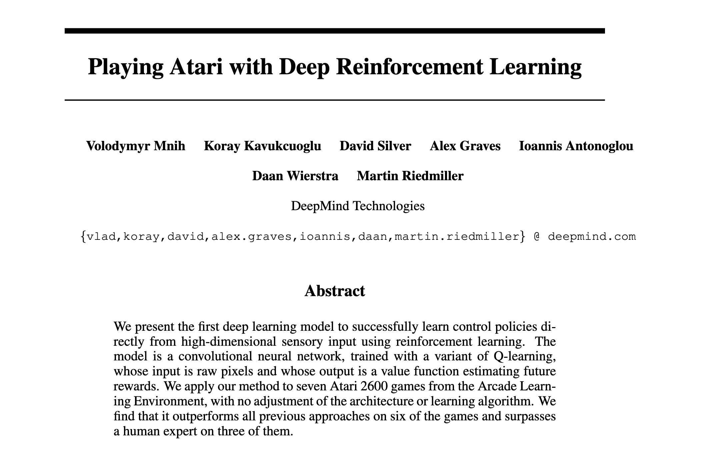
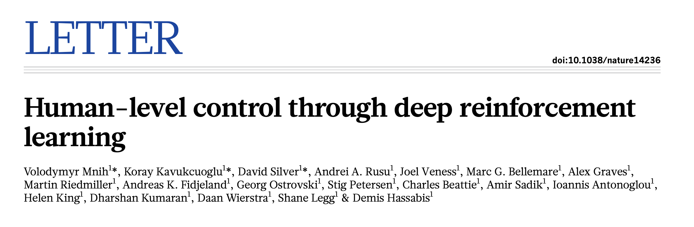
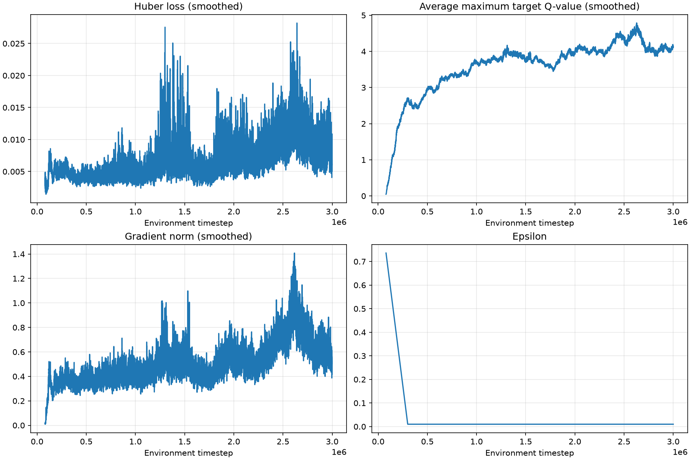
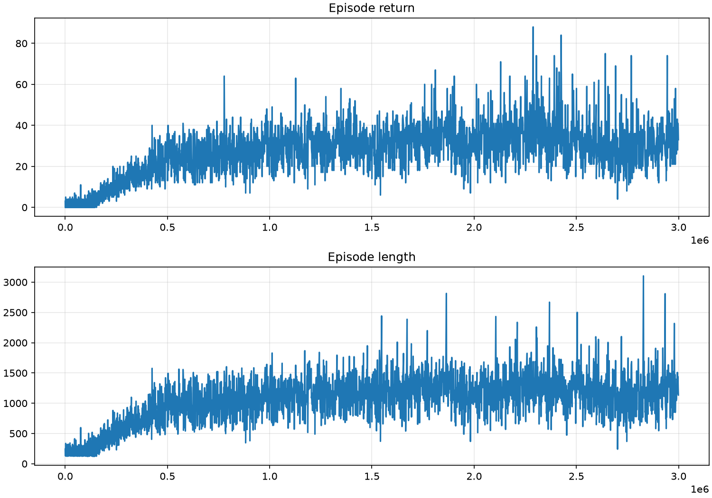
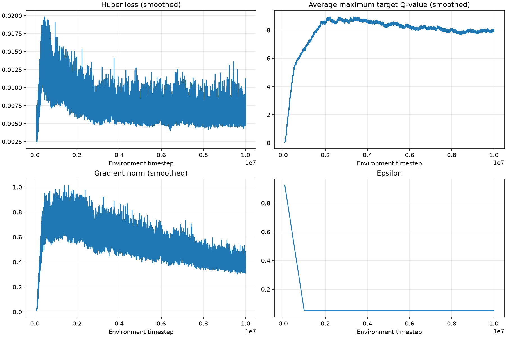
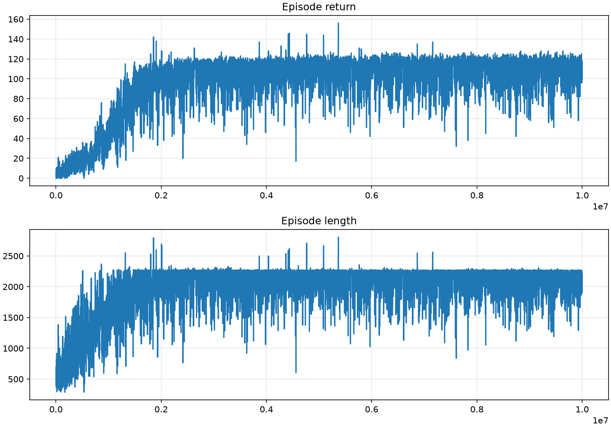
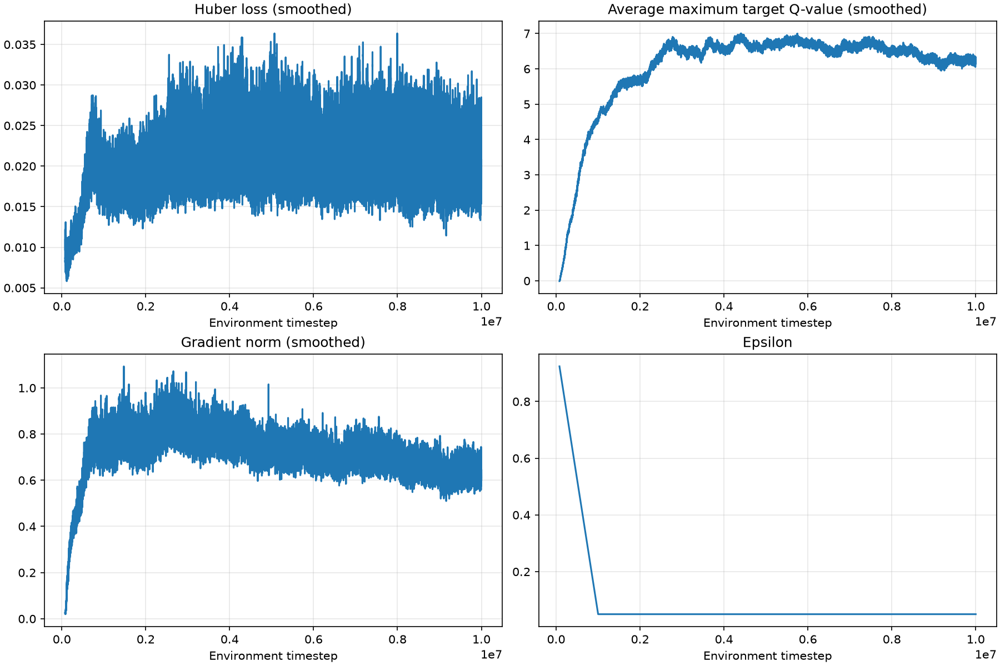
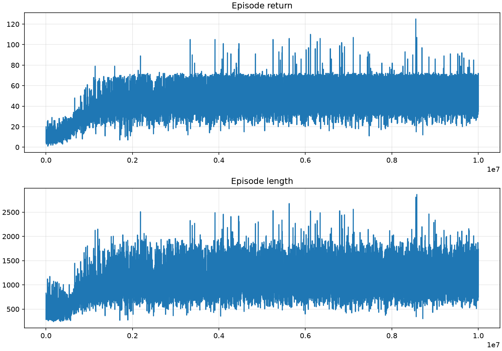
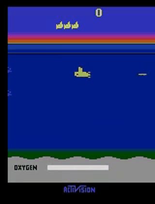

<p align="center">
  
  
</p>

## Setup

Create and activate the conda environment:

```bash
conda env create -f environment.yml
conda activate dqn-lite
```

For the CUDA 12.1 torch build, reinstall torch after activating:

```bash
pip install torch==2.5.1 --index-url https://download.pytorch.org/whl/cu121
```

## Tests

Run all tests from the project root:

```bash
python -m pytest tests/
```

## Algorithm

**Algorithm 1: deep Q-learning with experience replay (Nature, 2015).**

```math
\begin{aligned}
&\text{Initialize replay memory } D \text{ to capacity } N \\
&\text{Initialize action-value function } Q \text{ with random weights } \theta \\
&\text{Initialize target action-value function } \hat{Q} \text{ with weights } \theta^- = \theta \\
&\textbf{For} \text{ episode } = 1, M \textbf{ do} \\
&\quad \text{Initialize sequence } s_1 = \{x_1\} \text{ and preprocessed sequence } \phi_1 = \phi(s_1) \\
&\quad \textbf{For} \text{ } t = 1{,}T \textbf{ do} \\
&\quad\quad \text{With probability } \epsilon \text{ select a random action } a_t \\
&\quad\quad \text{otherwise select } a_t = \underset{a}{\mathrm{argmax}}\, Q(\phi(s_t){,}a; \theta) \\
&\quad\quad \text{Execute action } a_t \text{ in emulator and observe reward } r_t \text{ and image } x_{t+1} \\
&\quad\quad \text{Set } s_{t+1} = s_t{,}a_t{,}x_{t+1} \text{ and preprocess } \phi_{t+1} = \phi(s_{t+1}) \\
&\quad\quad \text{Store transition } (\phi_t{,}a_t{,}r_t{,}\phi_{t+1}) \text{ in } D \\
&\quad\quad \text{Sample random minibatch of transitions } (\phi_j{,}a_j{,}r_j{,}\phi_{j+1}) \text{ from } D \\
&\quad\quad \text{Set } y_j = \left\{ \begin{array}{rc} r_j & \text{if episode terminates at step } j+1 \\ r_j + \gamma \underset{a'}{\max} \hat{Q}(\phi_{j+1}{,}a'; \theta^-) & \text{otherwise} \end{array} \right. \\
&\quad\quad \text{Perform a gradient descent step on } \left( y_j - Q(\phi_j{,}a_j; \theta) \right)^2 \text{ with respect to the} \\
&\quad\quad \text{network parameters } \theta \\
&\quad\quad \text{Every } C \text{ steps reset } \hat{Q} = Q \\
&\quad \textbf{End For} \\
&\textbf{End For}
\end{aligned}
```

### Symbols

| Symbol | Meaning | Python |
|---|---|---|
| $D$, $N$ | replay memory and its capacity | `self.buffer` (`ReplayBuffer`, `src/buffer.py`), sized `cfg.buffer_size` |
| $Q(\phi, a; \theta)$ | action-value function and its weights | `self.network` (`QNetwork`), `self.network.parameters()` |
| $\hat{Q}(\phi, a; \theta^-)$ | target action-value function and its weights | `self.target_network`, synced via `load_state_dict` |
| $M$ | number of episodes | implicit: the loop runs `cfg.total_timesteps` steps; episodes are counted in `metrics["episodes"]` |
| $s_t$, $x_{t+1}$ | state sequence and raw image | handled inside the env wrapper; preprocessing is fused into the env (`src/dqn.py:103`) |
| $\phi_t$, $\phi_{t+1}$ | preprocessed state (4×84×84 frame stack) | `obs`, `next_obs`; stored in `buffer.obs`, `buffer.next_obs` |
| $\epsilon$ | probability of a random action | `eps`, from `linear_schedule(cfg.start_eps, cfg.end_eps, …)` |
| $a_t$ | action taken | `action` |
| $r_t$ | reward, clipped to {−1, 0, +1} | `reward` (`np.sign(reward)`) |
| $t$, $T$ | timestep, episode length | `timestep`, `episode_len` |
| $j$ | minibatch index | batch dim of `obs_b`, `acts_b`, `rews_b`, `next_obs_b`, `dones_b` (`cfg.batch_size` wide) |
| $\gamma$ | discount factor | `cfg.gamma` |
| $y_j$ | TD target | `td_target` |
| $(y_j - Q(\phi_j, a_j; \theta))^2$ | update loss | `nn.HuberLoss()(td_target, current_q)` (Huber, not squared error) |
| gradient step w.r.t. $\theta$ | weight update | `optimizer.step()` (Adam, `cfg.learning_rate`) |
| $C$ | steps between target resets | `cfg.target_update_freq` |


### Default hyperparameters (`QLearningConfig`)

| Hyperparameter | Default |
|---|---|
| `learning_rate` | 1e-4 |
| `buffer_size` | 200,000 |
| `batch_size` | 32 |
| `start_eps` | 1.0 |
| `end_eps` | 0.01 |
| `exploration_fraction` | 0.10 |
| `total_timesteps` | 3,000,000 |
| `learning_starts` | 80,000 |
| `train_frequency` | 4 |
| `target_update_freq` | 1,000 |
| `gamma` | 0.99 |
| `seed` | 67 |


## Machine Spec

| Component | Spec |
|---|---|
| CPU | Intel Core i5-13600KF |
| GPU | NVIDIA RTX 3070 Ti (8 GB VRAM) |
| RAM | 32 GB host (24 GB allocated to WSL2) |
| OS | WSL2 (Ubuntu) on Windows |


## Results

### Breakout

Trained for 3M steps in 1 hour 30 min. All hyperparameters use the defaults above.

<p align="center">
  
  
</p>

### Seaquest

Trained for 10M steps in 5 hours 12 min.

| Hyperparameter | Value | Default |
|---|---|---|
| `total_timesteps` | 10,000,000 | 3,000,000 |
| `end_eps` | 0.05 | 0.01 |
| `target_update_freq` | 5,000 | 1,000 |

All other hyperparameters use the defaults above.

<p align="center">
  
  
</p>

### Space Invaders

Trained for 10M steps in 5 hours 19 min.

| Hyperparameter | Value | Default |
|---|---|---|
| `total_timesteps` | 10,000,000 | 3,000,000 |
| `end_eps` | 0.05 | 0.01 |
| `target_update_freq` | 5,000 | 1,000 |

All other hyperparameters use the defaults above.

<p align="center">
  
  
</p>


## Play

<p align="center">
  
</p>

Run a trained checkpoint for one episode:

```bash
python play.py
```

The script plays one episode greedily with a trained checkpoint, prints the episode score, and saves a gameplay mp4 to `outputs/<run>/gameplay/`. Point the `ENV_ID` and `WEIGHTS` constants at the top of `play.py` to the environment and checkpoint you want to run.


## Papers

- [Human-level control through deep reinforcement learning](https://www.nature.com/articles/nature14236) (Nature, 2015)
- [Playing Atari with Deep Reinforcement Learning](https://arxiv.org/abs/1312.5602) (NIPS 2013 Deep Learning Workshop)
